# ROSES OS -- Master Brand DNA

> The Operating System of Remembrance

---

## Table of Contents

### Part I -- Brand Identity
1. [Brand Essence](#brand-essence)
2. [Mission & Vision](#mission--vision)
3. [Origin & Lineage](#origin--lineage)
4. [Audience](#audience)
5. [Brand Positioning](#brand-positioning)
6. [Brand Personality & Archetype](#brand-personality--archetype)
7. [Voice & Tone](#voice--tone)
8. [Messaging Pillars](#messaging-pillars)
9. [Key Language & Vocabulary](#key-language--vocabulary)
10. [The Two Core Questions](#the-two-core-questions)

### Part II -- The Technology
11. [The Technology -- What ROSES OS Is](#the-technology----what-roses-os-is)
12. [The Rose -- Core Inner Technology](#the-rose----core-inner-technology)
13. [Level 1 -- Foundational Practices](#level-1----foundational-practices)
14. [Level 2 -- Sacred Space & Chakra System](#level-2----sacred-space--chakra-system)
15. [Level 3 -- Advanced Perception](#level-3----advanced-perception)
16. [The Aura](#the-aura)
17. [What This Journey Awakens](#what-this-journey-awakens)
18. [The Codex -- Philosophical Container](#the-codex----philosophical-container)
19. [The Guardians](#the-guardians)
20. [Agreements & Virtues](#agreements--virtues)
21. [Sacred Use & Integrity](#sacred-use--integrity)
22. [Course Structure & Contribution Model](#course-structure--contribution-model)

### Part III -- Visual Identity & Design System
23. [Visual Identity System](#visual-identity-system)
24. [Color Palette](#color-palette)
25. [Typography](#typography)
26. [Imagery & Graphics](#imagery--graphics)
27. [Design Book](#design-book)

### Part IV -- Website & Digital Experience
28. [Website Style Guide](#website-style-guide)
29. [UI Components](#ui-components)
30. [Copy Style Rules](#copy-style-rules)
31. [Sitemap & Page Structure](#sitemap--page-structure)

---

# PART I -- BRAND IDENTITY

---

## Brand Essence

**Brand Name:** ROSES OS

**Brand Definition:** ROSES OS is not a self-improvement brand. It is a remembrance ecosystem. A system designed to restore coherence, inner symmetry, and presence in modern life.

> "Not as belief. As remembrance."
> "This is not learning. This is remembering."

ROSES OS exists to dissolve distortion and return people to truth.

**Core Promise:** A seamless path to:

- Inner freedom
- Coherence
- Awakened leadership
- Conscious prosperity
- Intuitive clarity

**Brand Statement:** ROSES OS is the operating system of coherence -- where intuition becomes precise and presence becomes sovereign.

**Brand Feeling:** ROSES OS should always feel like:

- Warm silence
- Sacred minimalism
- Calm authority
- Modern devotion
- Quiet genius awakening

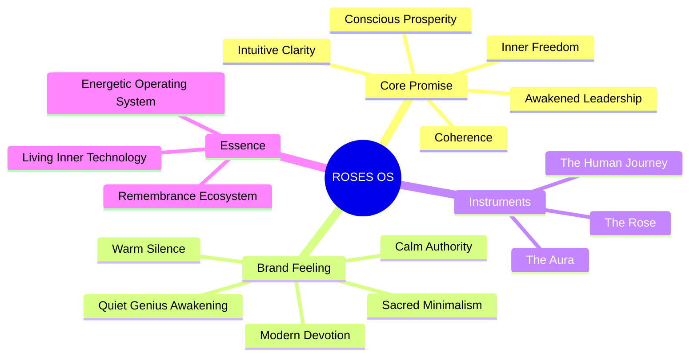

---

## Mission & Vision

**Mission:** To restore inner symmetry and coherence through simple, precise instruments of consciousness. ROSES OS is built for this moment -- where life moves fast and noise is constant.

**Vision:** A world where humans live, lead, create, and love from presence instead of distortion. Where life becomes creation instead of reaction.

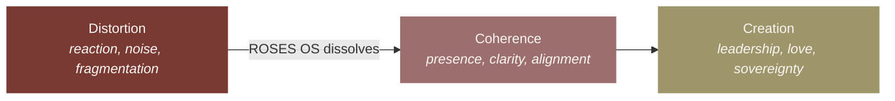

---

## Origin & Lineage

Aura Reading emerged in the 1960s, in California, channeled by a North American called **Lewis S. Bostwick**. Founder of the **Berkeley Psychic Institute** and the **Church of the Divine Man**, he channeled and systematized the techniques and tools sent by the angels, to assist in the process of evolution of humanity.

### Lineage Transmission

| Era | Name | Description |
|-----|------|-------------|
| **1960s** | Lewis S. Bostwick | Channeled the material of Aura Reading in California. Founder of the Berkeley Psychic Institute and the Church of the Divine Man. |
| **1980s** | Anastasia Plunk | Received and carried the Aura Reading and Rose meditation teachings from the Berkeley Psychic Institute, ensuring the continuity and integrity of the lineage. |
| **2000s** | Angelina Ataíde | Founder of CELARIS (Centro de Estudos de Leitura de Aura, Reiki, Intuicao e Sonhos), formerly known as Escola da Aura & Sueños. For more than thirty years, she has upheld and embodied the Rose as a living transmission, initiating more than six thousand individuals into the living field of the Rose. |
| **2026** | ROSES OS | The platform crystallizes decades of lineage wisdom into an accessible ecosystem for consciousness, remembrance, and coherent living. |

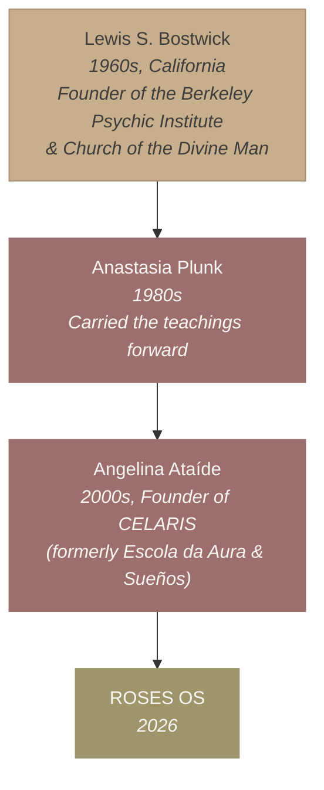

### Key Stats

- **30+** years of lineage
- **6,000+** practitioners initiated
- **50+** countries reached

These teachings are part of a living energetic lineage. They invite inner stillness, gentle discipline, and deep self-responsibility. ROSES OS is not a system to be imposed or taught casually -- it is an energetic operating system revealed through direct practice and transmission.

---

## Audience

### Who This Is For

Adults -- women and men -- especially:

- Seekers
- Healers
- Teachers
- Leaders
- Creators
- Founders
- Entrepreneurs
- Parents

For those who feel the world accelerating and know the tools they inherited were not built for this moment.

**Site headline:** "For those who sense there is more"
**Site copy:** "You may be someone who knows that the life you are living is not yet the life you came here to live. If something in these words resonates, the way is open."

### What They Feel

- The world accelerating
- Inner tools becoming outdated
- A call toward truth, simplicity, and stability

### Audience Desire

They want to move through complexity without losing themselves. They are ready to rise above noise. They are seeking alignment and peace.

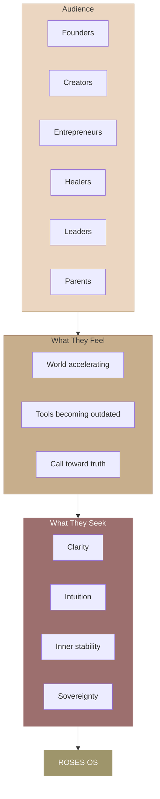

---

## Brand Positioning

**Category:** Spiritual-modern consciousness technology

### ROSES OS Is Not

- A belief system
- A healing loop
- A technique collection
- Performance spirituality

### ROSES OS Is

- Coherence
- Remembrance
- Energetic precision
- Inner operating system
- Decentralized simplicity
- Clarity
- Internal technology and alignment

**Differentiator:** Simple, living inner technology that doesn't fight noise and fragmentation -- it quietly dissolves the conditions that keep chaos alive.

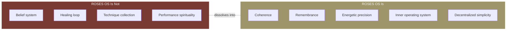

---

## Brand Personality & Archetype

ROSES OS is:

- Grounded
- Elegant
- Devotional
- Spacious
- Minimal
- Quietly powerful
- Slightly futuristic

**Archetype Blend:** The Mystic Guide x The Architect x The Modern Oracle

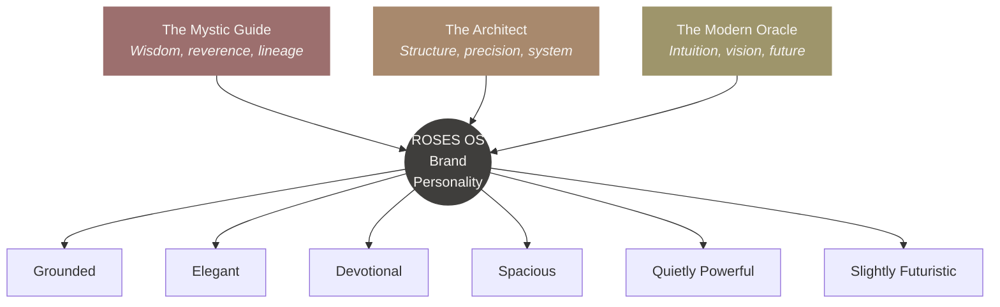

---

## Voice & Tone

### Voice Principles

ROSES OS speaks with:

- **Simplicity** -- Clear, unadorned language
- **Reverence** -- Sacred without being religious
- **Clarity** -- Precise, never vague
- **Spaciousness** -- Breathing room in every message
- **Calm Authority** -- Grounded, never forceful

### Tone

Never loud. Never bright. Never hype. The voice feels like:

- A temple
- A threshold
- A quiet invitation home

### What to Avoid

- Influencer spirituality
- Overly emotional marketing
- Corporate wellness tone
- Forced positivity
- Jargon-heavy tech language
- Hype or urgency-driven language

---

## Messaging Pillars

### Five Core Pillars

| Pillar | Statement |
|--------|-----------|
| **Coherence** | When coherence returns, life aligns. Restoring alignment across emotional, mental, and energetic systems. |
| **Remembrance** | This is not learning. This is remembering. |
| **Inner Symmetry** | Inner symmetry becomes the source of leadership and creation. |
| **Presence** | The work asks for presence, not perfection. |
| **Quiet Genius** | When distortion dissolves, Genius awakens. |

### Three Pillars (Site Display)

The homepage and invitation pages present three pillars that communicate "What This Journey Awakens":

| Pillar | Description |
|--------|-------------|
| **The Rose** | A sacred technology of remembrance: a systematic practice for reconnecting with the intelligence that lives within. |
| **The Aura** | The energetic body and its role in coherence: subtle awareness as a practical capacity for daily living. |
| **The Human Journey** | The recognition that every life is a journey of return, and that this journey is supported, not solitary. |

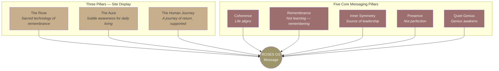

---

## Key Language & Vocabulary

### Core Vocabulary

- Coherence
- Symmetry
- Presence
- Remembrance
- Distortion dissolves
- Genius awakens
- Truth becomes effortless
- Inner freedom
- Frequency
- Sovereignty
- Clarity

### Signature Phrases

- "The Operating System of Remembrance"
- "When the Rose awakens, Genius awakens"
- "Not techniques, but instruments of consciousness"
- "You are the mountain, not the summit"
- "A frequency you cultivate"
- "The Rose is not a path you follow. It is a frequency you remember."
- "Remember who you are"
- "Welcome home"

### Brand Quotes (Site)

These quotes rotate across the site in hero sections, quote blocks, and brand essence sections:

- "The next revolution is not technological. It is a revolution of remembrance."
- "A seamless path to inner freedom."
- "You are not broken. You are not lost. You are remembering."
- "Coherence is not something you achieve. It is something you return to."
- "The way is open. Welcome home."
- "What if the intelligence you seek is already within you, waiting to be remembered?"
- "This is not self-help. This is self-remembrance."

---

## The Two Core Questions

The Rose asks two foundational questions:

1. **Are you aware of your inner state at this moment?**
2. **Do you feel coherent inside -- if not, how can you restore it?**

No belief needed. Just honest awareness and presence. When even a trace of coherence returns, clarity grows, and choice becomes real again.

---

# PART II -- THE TECHNOLOGY

---

## The Technology -- What ROSES OS Is

*"Insanity, as Einstein said, is expecting new results while repeating the same actions."*

We are building a future with inner tools from a world that no longer exists. Life now moves faster, louder, and more complex. We need inner tools -- simple, precise, and aligned to this moment.

**The Rose is an alternative.**

The Rose is simple, living inner technology:

- It restores awareness.
- It restores coherence.
- It restores real choice.

It doesn't fight the noise and fragmentation -- it quietly dissolves the conditions that keep chaos alive.

The Rose restores coherence across emotional, mental, and energetic systems -- making intuition precise and presence sovereign. Simple and decentralized, it frees you from endless healing and returns you to natural alignment.

### The Full Path -- Eight Levels

The site presents eight levels across two tracks: Rose Meditation (3 levels) and Aura Reading (5 levels).

| Level | Title | Subtitle | Focus |
|-------|-------|----------|-------|
| 1 | **Rose Meditation 1** | The Open Threshold | Grounding & presence, aura cleansing & protection, energy separation, Earth & Cosmic circuits |
| 2 | **Rose Meditation 2** | The Living Rhythm | Chakra & aura layer cleansing, energetic tie release, sacred space creation, environmental protection |
| 3 | **Rose Meditation 3** | The Spiritual Activation | Spiritual agreements & cords, belief transcendence, mental program cleansing, Reality Creation (Mock Up) |
| 4 | **Aura 1** | The Initiation | Aura reading initiation, healing journeys, chakra & universal teachings, energy of love |
| 5 | **Aura 2** | Perceptual Deepening | Theme readings, refined clairvoyance, advanced reading techniques, deepened perception |
| 6 | **Aura 3** | Relationships & Healing | Relational energy dynamics, relationship healing, interpersonal navigation, expanded intuitive capacity |
| 7 | **Aura 4** | The Living Transmission | In-person transmission, guardian-held field, embodied coherence, community practice |
| 8 | **Aura 5** | Sovereign Mastery | Unified mastery, conscious creation, heart-led expression, full sovereignty |

```mermaid
graph LR
    L1["Rose Meditation 1<br/><i>The Open Threshold</i>"]
    L2["Rose Meditation 2<br/><i>The Living Rhythm</i>"]
    L3["Rose Meditation 3<br/><i>The Spiritual Activation</i>"]
    A1["Aura 1<br/><i>The Initiation</i>"]
    A2["Aura 2<br/><i>Perceptual Deepening</i>"]
    A3["Aura 3<br/><i>Relationships & Healing</i>"]
    A4["Aura 4<br/><i>The Living Transmission</i>"]
    A5["Aura 5<br/><i>Sovereign Mastery</i>"]

    L1 ==> L2 ==> L3
    L3 ==> A1 ==> A2 ==> A3
    A3 -.-> A4 -.-> A5

    style L1 fill:#C7AE8C,color:#3F3E3C,stroke:#A8896D
    style L2 fill:#C7AE8C,color:#3F3E3C,stroke:#A8896D
    style L3 fill:#9C6F6E,color:#F7F5F2,stroke:#9C6F6E
    style A1 fill:#9C6F6E,color:#F7F5F2,stroke:#9C6F6E
    style A2 fill:#9C6F6E,color:#F7F5F2,stroke:#9C6F6E
    style A3 fill:#9E956B,color:#F7F5F2,stroke:#9E956B
    style A4 fill:#7A3A34,color:#F7F5F2,stroke:#7A3A34
    style A5 fill:#7A3A34,color:#F7F5F2,stroke:#7A3A34
```

---

## The Rose -- Core Inner Technology

The Rose is the foundational symbol and tool of this practice -- a living energetic instrument used throughout all levels of the work. It has roots (connection to source), a stem (channel of energy), and a bloom (the active, radiant tool). The Rose can be placed, moved, opened, closed, and released according to the needs of the meditation.

**When the Rose awakens, Genius awakens.**

The Rose dissolves distortion and restores coherence. Inner awareness expands, presence and stability deepen. From this state, intuition sharpens, leadership rises, and connection becomes natural.

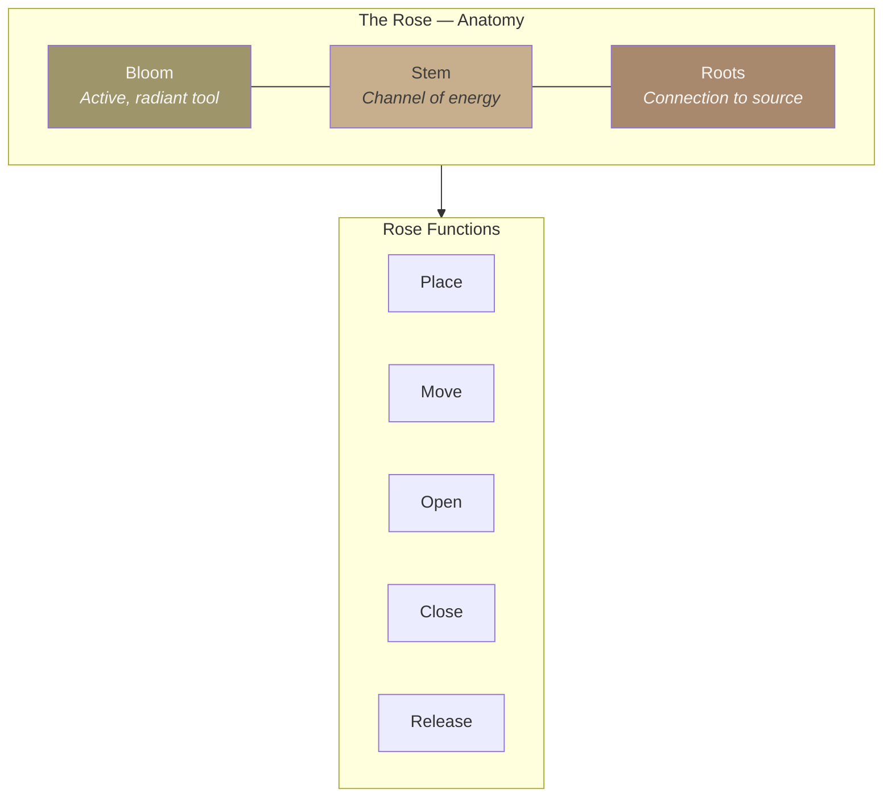

---

## Level 1 -- Foundational Practices

### Posture

Proper meditation posture is seated upright in a chair. Feet are flat on the floor, hands resting gently on the thighs or knees, spine upright, eyes closed. The body is relaxed yet alert -- grounded and receptive.

### Grounding Cord

The grounding cord is an energetic connection that extends from the base of the spine (first chakra) downward into the center of the Earth. It anchors your energy body to the planet, providing stability, safety, and a channel for releasing unwanted energy.

### Golden Sun

The Golden Sun is a tool for replenishing and restoring your own energy. Visualize a radiant golden sun above your head. It calls back your own life-force energy from wherever you may have left it -- in people, places, situations, or time. It fills you with your own highest vibration.

### Feeling Your Aura

The aura is the energetic field that surrounds your physical body. This exercise helps you become aware of its presence, its edges, and its quality. The aura consists of multiple layers radiating outward from the body.

### Grounding Cord with Aura

Once you are aware of your aura, the grounding cord practice deepens. You ground not only the physical body but also the aura itself -- allowing the entire energy field to anchor into the Earth.

### Full Meditation Setup

The complete foundational setup combines all three elements: the person is seated in proper posture, enclosed within their aura, with the grounding cord descending into the earth and the golden sun shining above the crown.

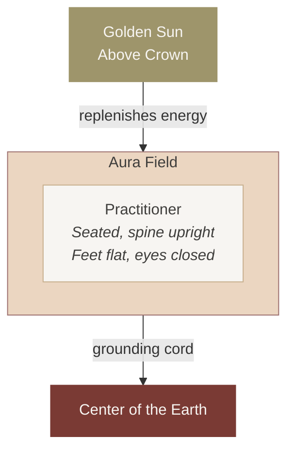

### Circuit of the Energy of the Earth

The Earth circuit is an energetic pathway that draws the energy of the Earth upward through the feet, rising through the legs and into the body. This circuit connects you to the grounding, nourishing, stabilizing force of the planet.

### Circuit of the Energy of the Cosmos

The Cosmic circuit is an energetic pathway that draws cosmic energy downward through the crown of the head (7th chakra) and into the body. This circuit connects you to the higher frequencies of universal consciousness, inspiration, and spiritual guidance.

### Circuit of Energy of Cosmos and Earth

When both circuits are activated simultaneously, the energies of the Earth and Cosmos flow together through the body. Earth energy rises from below; Cosmic energy descends from above. They meet and blend within the body, creating a unified field of balanced, integrated energy.

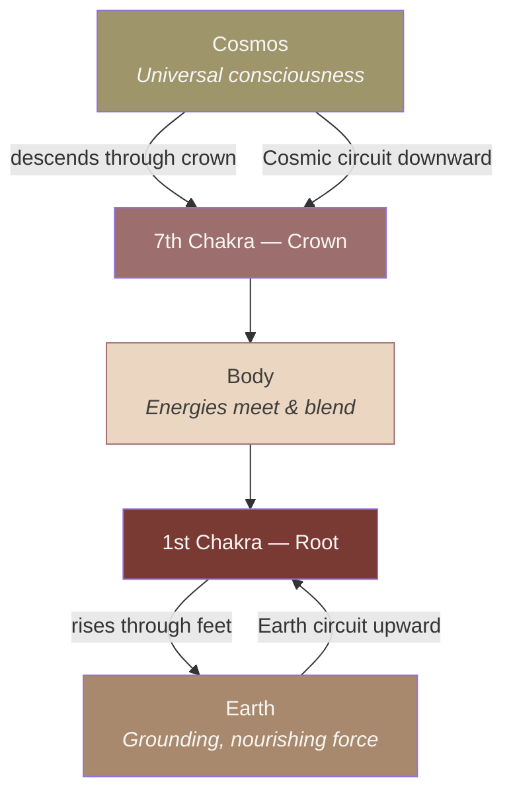

### Roses of Protection, Observation and Separation

Roses are placed at the edges of the aura to serve as energetic sentinels:

1. **Protection** -- They define and guard the boundary of your aura
2. **Observation** -- They help you notice what energies are approaching or interacting with your field
3. **Separation** -- They create healthy energetic distinction between your energy and the energy of others

### Cleansing Rose

The Cleansing Rose is placed outside of the aura. It is used to absorb and transmute foreign or stagnant energy from within your field. Energy that does not belong to you -- from other people, environments, or experiences -- is drawn out of the aura and into the Cleansing Rose, where it is neutralized.

### Energy Recovery of Each Chakra

After cleansing, the Rose is used to recover your own energy that has been left in or taken by others. The Rose is sent out as an instrument to gather and return your own life-force energy to each chakra, restoring fullness and sovereignty to each energy center.

### Discharge Excess Energy

After deep meditation or energy work, excess energy may accumulate in the body. To discharge it, lean forward from the seated position with hands reaching toward the ground. Allow the excess energy to flow out through the hands and into the earth, returning the body to a calm, balanced state.

### Level 1 Practice Sequence


---

## Level 2 -- Sacred Space & Chakra System

### Creating Your Sacred Space

Level 2 begins with creating your own sacred space -- an internal energetic environment that serves as your meditation home. This is the space from which all deeper work is conducted.

### The 6th and 7th Chakras

- **6th Chakra (Third Eye)** -- Located at the center of the forehead, between and slightly above the eyebrows
- **7th Chakra (Crown)** -- Located at the top of the head

### Preparing Your Physical Space

Before meditation, prepare your physical environment to support the energetic work. The external space should mirror the internal intention: clean, clear, quiet, and intentionally held.

### Protection of the Space

The physical meditation space is protected by creating an energetic grid using roses. Golden roses are placed at the four corners (and above/below) of the space, connected by lines of golden energy forming a sacred geometric structure -- a container for the work.

### Cleansing of the Space

Once the space is protected, it is cleansed. A large Cleansing Rose is placed above the grid, and golden energy pours downward through the entire structure, clearing all foreign, stagnant, or disruptive energies from the space.

### Owning Your Space

After protection and cleansing, you claim ownership of the space. This is an act of energetic sovereignty -- declaring the space as yours, filling it with your own energy and intention.

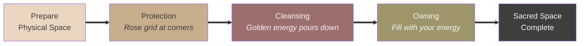

### The Seven Chakras

| # | Chakra | Location | Color |
|---|--------|----------|-------|
| 7 | **Crown** | Top of head | Violet & White |
| 6 | **Third Eye** | Center of forehead | Indigo |
| 5 | **Throat** | Throat | Light Blue |
| 4 | **Heart** | Center of chest | Green / Pink |
| 3 | **Solar Plexus** | Upper abdomen | Yellow |
| 2 | **Sacral** | Lower abdomen | Orange |
| 1 | **Root** | Base of spine | Red |

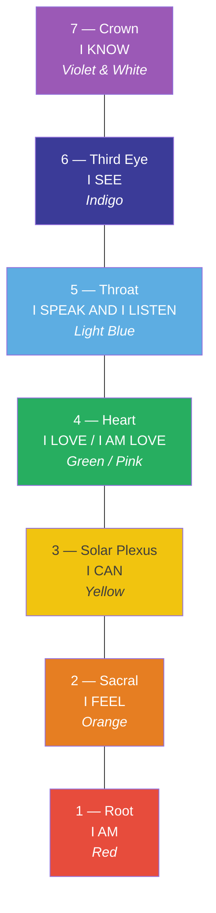

### Root Chakra -- Muladhara

**Grounding & Safety**

| Attribute | Detail |
|-----------|--------|
| Core Statement | **I AM** |
| Color | Red |
| Element | Earth |
| Body Location | Base of spine, Legs, Feet |
| Energy | Masculine -- Survival / Foundation |
| Focus | Stability -- Safety -- Embodiment |

| Balanced | Unbalanced |
|----------|------------|
| Grounded presence | Fear and insecurity |
| Physical vitality | Survival anxiety |
| Trust in life | Disconnection from body |
| Feeling safe in the body | Scarcity mindset |

**Primary Blockages:** Fear -- Insecurity -- Survival Trauma

### Sacral Chakra -- Svadhisthana

**Emotion & Creativity**

| Attribute | Detail |
|-----------|--------|
| Core Statement | **I FEEL** |
| Color | Orange |
| Element | Water |
| Body Location | Lower abdomen, Sexual Organs |
| Energy | Feminine -- Flow & Flexibility |
| Focus | Emotions -- Creativity -- Pleasure |

| Balanced | Unbalanced |
|----------|------------|
| Emotional well-being | Depression and numbness |
| Sensuality and intimacy | Sexual dysfunction |
| Passion and pleasure | Emotional instability |
| Adaptability | Fear of change |

**Primary Blockages:** Shame -- Emotional Repression -- Guilt

### Solar Plexus Chakra -- Manipura

**Willpower & Confidence**

| Attribute | Detail |
|-----------|--------|
| Core Statement | **I CAN** |
| Color | Yellow |
| Element | Fire |
| Body Location | Upper abdomen, Diaphragm |
| Energy | Masculine -- Power & Transformation |
| Focus | Personal Power -- Self-Esteem -- Drive |

| Balanced | Unbalanced |
|----------|------------|
| Confidence and motivation | Low self-esteem |
| Responsible and disciplined | Aggression or controlling |
| Healthy sense of self | Stubborn and domineering |
| Autonomy | Lack of direction or purpose |

**Primary Blockages:** Self-Doubt -- Insecurity -- Fear of Rejection

### Heart Chakra -- Anahata

**Love & Integration**

| Attribute | Detail |
|-----------|--------|
| Core Statement | **I LOVE** |
| Color | Green (Human Love) / Pink (Divine / Unconditional Love) |
| Element | Air |
| Body Location | Center of chest, Heart, Lungs |
| Energy | Bridge between physical & spiritual |
| Focus | Love -- Compassion -- Connection |

*Balancing self and others, physical and spiritual realms.*

| Balanced | Unbalanced |
|----------|------------|
| Compassion and empathy | Emotional withdrawal or over-giving |
| Emotional openness | Fear of intimacy |
| Forgiveness | Cold or detachment |
| Healthy intimacy and self-love | Difficulty forgiving |

**Primary Blockages:** Grief -- Betrayal -- Heartbreak

#### Human Love & Spiritual Love

| Human Love | Spiritual Love |
|-----------|---------------|
| Statement: **I LOVE** | Statement: **I AM LOVE** |
| Empathy and compassion | Unconditional compassion |
| Forgiveness | Interconnectedness |
| Healthy relationships | Divine and universal love |
| Romantic and familial love | Oneness |

**Primary Blockages:** Grief -- Loss -- Trauma -- Resentment -- Lack of Self-Love -- Disconnection from Spirit

### Throat Chakra -- Vishuddha

**Communication & Expression**

| Attribute | Detail |
|-----------|--------|
| Core Statement | **I SPEAK AND I LISTEN** |
| Color | Light Blue |
| Element | Ether / Sound |
| Body Location | Throat, Neck, Jaw, Mouth |
| Energy | Learning to align will with divine truth |
| Focus | Communication -- Truth -- Authenticity |

*Speaking and listening to truth clearly and authentically.*

| Balanced | Unbalanced |
|----------|------------|
| Clear, honest communication | Fear of speaking up |
| Authentic self-expression | Being unheard or misunderstood |
| Good listener | People-pleasing |
| Strong voice and balanced speech | Suppressed feelings or lies |

**Primary Blockages:** Suppressed Truth -- Fear of Expression -- Miscommunication

### Third Eye Chakra -- Ajna

**Intuition & Insight**

| Attribute | Detail |
|-----------|--------|
| Core Statement | **I SEE** |
| Color | Indigo |
| Element | Light |
| Body Location | Forehead, Brow, Eye center |
| Energy | Feminine aspects of awareness |
| Focus | Imagination -- Perception -- Visualization |

*Opening the mind's eye and deeper levels of perception.*

| Balanced | Unbalanced |
|----------|------------|
| Clear seeing and intuition | Overthinking |
| Good memory and imagination | Mental fog |
| Inner location | Disconnection with inner guidance |
| Wisdom and vision | Escaping reality or spiritual bypassing |

**Primary Blockages:** Suppressed Truth -- Fear of Expression -- Miscommunication

### Crown Chakra -- Sahasrara

**Spirituality & Consciousness**

| Attribute | Detail |
|-----------|--------|
| Core Statement | **I KNOW** |
| Color | Violet & White |
| Element | Thought & Universal Connection |
| Body Location | Top of head |
| Energy | Transcending ego, merging with source |
| Focus | Spiritual Connection -- Inner Wisdom -- Higher States of Awareness |

*Awakening to pure consciousness, divine oneness, and universal connection.*

| Balanced | Unbalanced |
|----------|------------|
| Spiritual faith and connection | Spiritual emptiness |
| Inner peace, trust, and wisdom | Existential doubt |
| Openness and awareness | Feeling isolated or alone |
| Sense of life purpose | Lack of purpose |

**Primary Blockages:** Disconnection -- Cynicism -- Loss of Meaning

### Cleansing of Each Aura Layer

The aura is composed of seven layers, each corresponding to a chakra. Each layer is individually cleansed from the outermost to the innermost:

| Layer | Aura Layer |
|-------|-----------|
| 7 | 7th Aura layer |
| 6 | 6th Aura layer |
| 5 | 5th Aura layer |
| 4 | 4th Aura layer |
| 3 | 3rd Aura layer |
| 2 | 2nd Aura layer |
| 1 | 1st Aura layer |

### Cleansing of Each Chakra

Each individual chakra is cleansed using roses addressing two dimensions:

- **Dynamics of the Past** -- Energetic patterns, imprints, and blockages carried from past experiences
- **Dynamics of the Present** -- Current energetic influences, relationships, and situations affecting the chakra

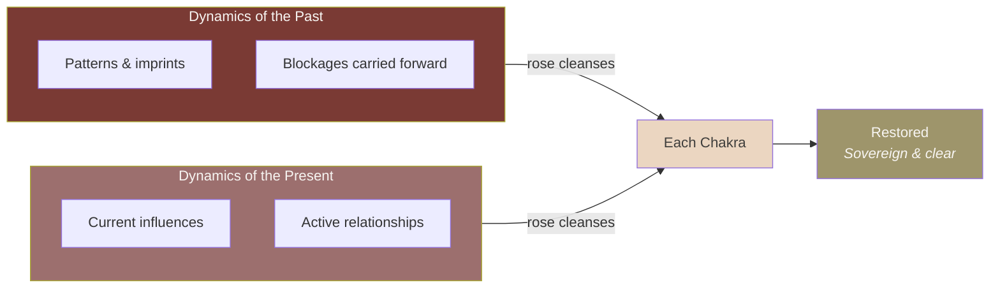

### Golden Sticky Roses

Golden Sticky Roses are a powerful cleansing and recovery technique. Small golden roses are placed directly on and within the body at specific locations to draw out deeply embedded foreign energy and restore your own.

**Phase 1 -- Chakra Placement:** Golden sticky roses placed on each of the seven chakras, drawing out foreign energy lodged in the energy centers.

**Phase 2 -- Body Placement:** Golden sticky roses placed at the joints and extremities -- shoulders, elbows, wrists, hands, hips, knees, ankles, feet -- drawing out foreign energy stored in the physical body.

**Phase 3 -- Full Body Coverage:** Golden sticky roses placed throughout the entire body for thorough, complete energetic cleansing.

**Phase 4 -- Integration:** A large Golden Rose appears above the head. All foreign energy gathered by the sticky roses is released, and the entire body is bathed in golden light -- restoring, sealing, and integrating the energy body.

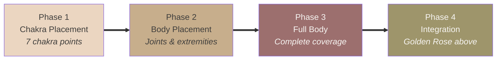

### Level 2 Practice Sequence

```mermaid
graph LR
    A["Create<br/>Sacred Space"] --> B["6th & 7th<br/>Chakras"]
    B --> C["Prepare<br/>Physical Space"]
    C --> D["Protect<br/>the Space"]
    D --> E["Cleanse<br/>the Space"]
    E --> F["Own<br/>the Space"]
    F --> G["Chakra<br/>Deep Dive"]
    G --> H["Cleanse<br/>Aura Layers"]
    H --> I["Cleanse<br/>Each Chakra"]
    I --> J["Energy<br/>Recovery"]
    J --> K["Golden<br/>Sticky Roses"]

    style A fill:#EBD6C1,color:#3F3E3C
    style B fill:#EBD6C1,color:#3F3E3C
    style C fill:#C7AE8C,color:#3F3E3C
    style D fill:#C7AE8C,color:#3F3E3C
    style E fill:#C7AE8C,color:#3F3E3C
    style F fill:#9C6F6E,color:#F7F5F2
    style G fill:#9C6F6E,color:#F7F5F2
    style H fill:#9C6F6E,color:#F7F5F2
    style I fill:#9E956B,color:#F7F5F2
    style J fill:#9E956B,color:#F7F5F2
    style K fill:#9E956B,color:#F7F5F2
```

---

## Level 3 -- Advanced Perception

### Analyzer

The Analyzer is an advanced tool introduced in Level 3. It is an energetic point located at the back of the head, at the base of the skull (the occipital ridge / brainstem area). The Analyzer is used for deeper perception, reading, and discernment of energy -- a tool for precise energetic analysis.

---

## The Aura

When heart aligns with soul, you perceive subtle senses and the energy shaping your choices. Each reading is a mirror -- strengthening clarity, relationships, and service.

Aura sharpens perception, revealing what shapes your choices, relationships, and reality.

- **The Rose** awakens perception.
- **Aura** empowers relationship.
- **Together**, they restore coherence, love, and confidence.

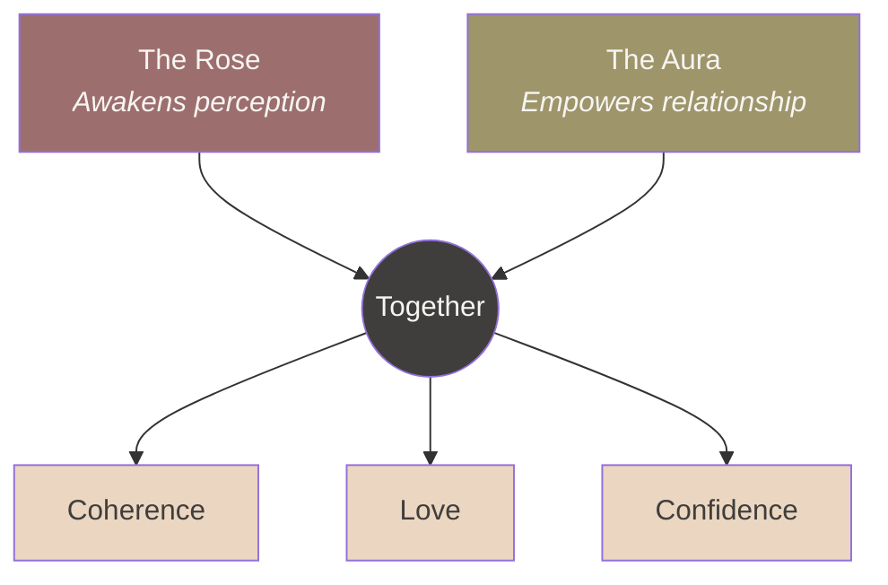

---

## What This Journey Awakens

*This is not learning. It is remembering.*

The site presents six dimensions of awakening across a 3-column grid:

### The Rose

It dissolves distortion and restores coherence. Inner awareness expands, presence and stability deepen. From this state, intuition sharpens, leadership rises, and connection becomes natural.

### Aura

When heart aligns with soul, you perceive subtle senses and the energy shaping your choices. Each reading is a mirror -- strengthening clarity, relationships, and service.

### Human Journey

Emotional patterns and imprints dissolve -- freed across mental and energetic layers. Love reveals itself as a self-organizing intelligence.

### Intuition

You learn to listen to truth with clarity and simplicity. Limiting beliefs and unconscious patterns dissolve. Your decisions become aligned, precise, and guided.

### Leadership

It deepens your capacity to feel, support, and relate. Leadership rooted in coherence, empowerment, and trust. You read your own field and the energy around you with discernment and self-mastery.

### Your Highest Potential

You access the brilliance of your original design. You live your life from pure integrity. These belong to every human who remembers who they are.

**No prior experience is needed. Only presence.**

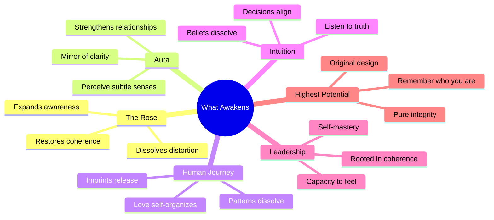

---

## The Codex -- Philosophical Container

The Codex is the philosophical container of ROSES OS: a map of the territory, an articulation of the architecture, and an invitation to remember what has always been true. It is not a rigid doctrine but a living document that deepens as you do.

### What is Coherence?

Coherence is the state in which all dimensions of being (body, heart, mind, and soul) move as one integrated field. It is not a concept to understand but a reality to embody, a felt sense of alignment that transforms every layer of life.

### Sacred Purpose

ROSES OS exists to remember what was never lost. It is a living document, a field of practice, and a sacred container designed to support human beings in returning to the coherence that is their birthright. This is not about acquiring something new. It is about uncovering what has always been present, beneath the noise, the conditioning, and the forgetting.

### 13 Domains of Coherence

| # | Domain | Description |
|---|--------|-------------|
| 1 | **Physical Coherence** | Alignment of the body: posture, breath, movement, and somatic awareness as the foundation of all practice. |
| 2 | **Emotional Coherence** | The capacity to feel fully without being governed by reactivity. Emotional intelligence as a doorway to freedom. |
| 3 | **Mental Coherence** | Clarity of thought without compulsive thinking. The mind as an instrument rather than a master. |
| 4 | **Relational Coherence** | Authentic connection with others rooted in presence, boundaries, and compassion rather than performance. |
| 5 | **Creative Coherence** | Access to the creative impulse as a natural expression of aligned being rather than forced production. |
| 6 | **Vocational Coherence** | Work as an expression of purpose. The alignment of livelihood with authentic calling. |
| 7 | **Financial Coherence** | A healthy relationship with resources: receiving, stewarding, and circulating with ease and integrity. |
| 8 | **Sexual Coherence** | The integration of life force energy. Embodied presence in intimacy and creative power. |
| 9 | **Spiritual Coherence** | Direct connection with the sacred: not as belief but as lived experience and continuous remembrance. |
| 10 | **Environmental Coherence** | Harmony between the individual and their spaces, ecosystems, and the living world. |
| 11 | **Ancestral Coherence** | Healing the lineage. Transforming inherited patterns into gifts and reclaiming the wisdom of those who came before. |
| 12 | **Temporal Coherence** | Right relationship with time: neither rushing nor stagnating. The art of sacred timing. |
| 13 | **Universal Coherence** | The recognition of belonging to something vast. Alignment with the intelligence that moves through all things. |

### Four Architecture Layers

| Layer | Name | Description |
|-------|------|-------------|
| 1 | **Hardware** | The physical body: bones, muscles, organs, nervous system. The vessel through which all experience flows. |
| 2 | **Software** | The mind: beliefs, patterns, conditioning, and the stories we carry. The programs that run our experience. |
| 3 | **Heartware** | The emotional and relational intelligence. The felt sense of connection, compassion, and coherence. |
| 4 | **Soulware** | The deepest layer: essence, purpose, and the remembrance of who we truly are beneath all conditioning. |

### Eleven Capacities

| # | Capacity | Description |
|---|----------|-------------|
| 1 | **Stillness** | The capacity to be at rest (internally and externally) as a foundation for all action. |
| 2 | **Presence** | The ability to be fully here, now, without the need to be elsewhere. |
| 3 | **Breath** | Conscious relationship with the breath as the bridge between body and awareness. |
| 4 | **Feeling** | The willingness to feel completely: pleasure, pain, and everything in between. |
| 5 | **Listening** | Deep receptivity: to self, others, and the intelligence of the larger field. |
| 6 | **Discernment** | Clear seeing without judgment. The capacity to distinguish truth from noise. |
| 7 | **Courage** | The heart-strength to act on what is true, even when it is uncomfortable. |
| 8 | **Surrender** | The art of releasing control without collapsing. Trusting the larger intelligence. |
| 9 | **Integration** | The ongoing work of bringing insights into lived experience and daily practice. |
| 10 | **Service** | The natural movement from inner coherence to outer contribution. |
| 11 | **Remembrance** | The ultimate capacity: not learning something new but remembering what has always been true. |

### Coherence Vocabulary Alternatives

Words that can replace "coherence" in domain titles and copy to vary tone and resonance:

| Tone | Alternatives |
|------|-------------|
| **Inner Alignment / Spiritual** | Alignment, Harmony, Integration, Wholeness, Inner Order, Unity, Centeredness |
| **Nervous System / Somatic** | Regulation, Stability, Balance, Groundedness, Equilibrium |
| **Signal / Technology Metaphor** | Clarity, Signal Integrity, Resolution, Synchronization, Clean Signal, Calibration |
| **Freedom / Sovereignty** | Self-possession, Sovereignty, Agency, Presence, Inner Freedom |
| **Simple Everyday** | Stillness, Flow, Peace, Ease, Consistency |

---

## The Guardians

### Angelina Ataíde -- Guardian of Lineage

A pioneer in Aura Reading education in Brazil and Portugal, Angelina has dedicated over three decades to spiritual development and training aura readers. Her transformative methodology has already trained thousands of students, therapists, and teachers -- combining spiritual wisdom with practical techniques as the primary steward of the ROSES OS lineage.

### Diego Dosal -- Guardian of Architecture & Structure

Diego is the bridge between spirit and structure. With over a decade of deep roots in multiple paths of spiritual practice, energy work, and community building, he carries the horizontal axis of ROSES OS -- developing platforms, systems, and frameworks that harmonize intuition with strategy and build lasting foundations for this work.

### Dara Ayoub -- Guardian of Community & Programs

With over a decade walking the Aura Reading path and a background in multiple traditions of self-knowledge, Dara integrates body, mind, and spirit with reverence. She supports the creation and delivery of programs and courses, blending intuitive listening with grounded clarity.

### Peggy Mars -- Guardian of Methodology

Peggy creates bridges between cultures, communities, and inner worlds. With over two decades walking the Aura Reading path, she integrates emotional, ancestral, and spiritual layers with clarity and compassion -- sustaining authentic connection between teachers and students.

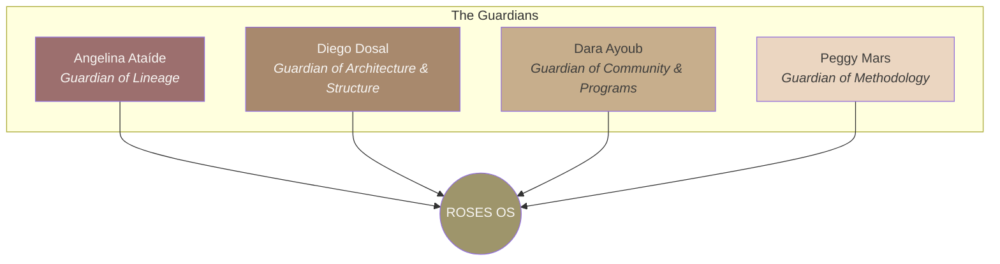

---

## Agreements & Virtues

All participants honor these five sacred agreements:

1. **Commitment to Practice** -- I commit to engaging with the daily practice for the duration of the program with sincerity and consistency.
2. **Confidentiality** -- I agree to hold in confidence what is shared in group settings, honoring the sacred container of our community.
3. **Respect for the Lineage** -- I honor the origins of this work and agree not to teach or represent these practices as my own without authorization.
4. **Personal Responsibility** -- I take responsibility for my own well-being and will communicate with the guardians if I need additional support.
5. **Community Care** -- I commit to showing up with care and respect for all participants, guardians, and the shared field of our practice.

---

## Sacred Use & Integrity

This manual is a sacred companion for those who have been initiated into the path of Rose Meditation.

### To honor the integrity of this work:

- Please do not share this material with others who have not received the transmission.
- This manual is for personal use only and cannot be used to teach or guide others.
- You are welcome to support children under your care with these tools.

*Let each page be a reminder of the sacred space within you.*

---

## Course Structure & Contribution Model

### Option 1 -- The Rose

- **Subtitle:** Rose Meditation Level 1, 2 & 3
- Two immersive days, live online + recorded content
- Six hours per day, offered in two three-hour sessions
- **Dates:** March 17--18, 2026
- **Includes:** 2 immersive days of live instruction, Rose Meditation Levels 1, 2 & 3, two 3-hour sessions per day, integration workbook, private community access to classes and events, multi-timezone support

### Option 2 -- The Rose + Aura 1

- **Subtitle:** Complete Immersion
- Eleven days combining Rose Meditation Levels 1, 2 & 3 with Aura Reading Level 1
- Live online + recorded content
- **Dates:** March 17--27, 2026
- **Includes:** Rose Meditation Levels 1, 2 & 3 (2 days), Aura Reading Level 1 (9 days), daily Rose Meditation guidance, flexible practice sessions, integration workbook, private community access to classes and events, multi-timezone support

### Contribution Model

This work is offered in devotion. An income-based contribution model ensures that your financial season is honored while sustaining the ecosystem for all. You are invited to choose a contribution that reflects your truth.

| Tier | Income Range | The Rose (2 days) | The Rose + Aura 1 (11 days) |
|------|---|---|---|
| **Seed** | Under $30,000 USD | $222 | $888 |
| **Bloom** | $30,000 -- $70,000 USD | $444 | $1,444 |
| **Canopy** | Above $70,000 USD | $777 | $2,111 |

- **Seed** -- Honors your reality and current season.
- **Bloom** -- Reflects reciprocity and balance.
- **Canopy** -- Supports accessibility for others and the expansion of this work.

Your support allows these technologies to reach more people worldwide.

```mermaid
graph TD
    subgraph ROSE_COURSE["The Rose — 2 Days Online"]
        D1["Day 1<br/>3hr + 3hr"]
        D2["Day 2<br/>3hr + 3hr"]
    end

    subgraph AURA_COURSE["The Rose + Aura 1 — 11 Days"]
        S1["Rose Meditation (2 days)"]
        S2["Aura Reading (9 days)"]
    end

    subgraph CONTRIBUTION["Contribution Model"]
        T1["Seed<br/><i>$222 / $888</i>"]
        T2["Bloom<br/><i>$444 / $1,444</i>"]
        T3["Canopy<br/><i>$777 / $2,111</i>"]
    end

    ROSE_COURSE --> AURA_COURSE
    AURA_COURSE --> CONTRIBUTION

    style ROSE_COURSE fill:#9C6F6E,color:#F7F5F2
    style AURA_COURSE fill:#9E956B,color:#F7F5F2
    style CONTRIBUTION fill:#EBD6C1,color:#3F3E3C
```

---

## The Frequency

> When you become aware of your inner state and the landscape, coherence emerges and life aligns around the truth you are ready to embody.

The Rose is not a path you follow. It is a **frequency you cultivate**.

No belief required. Only presence and willingness to return to your essence. Then choose yourself, clarity, and freedom. From there, life becomes creative and reaching.

**And so, remember who you are.**

---

# PART III -- VISUAL IDENTITY & DESIGN SYSTEM

---

## Visual Identity System

### Visual World

**Earthy Spiritual Modern + Sacred Tech Minimalism**

The design should feel like:

- Stone
- Clay
- Silence
- Breath
- Warmth
- Geometry
- Modern sacredness

### The Elegance-Tech Bridge

- Inter + spacing + restraint = technology
- Cormorant + texture + clay = devotion
- Rose Clay Mauve sits between them

**Rose Clay Mauve is the human interface layer of ROSES OS.** Alive. Calm. Intelligent.

```mermaid
graph LR
    TECH["TECHNOLOGY<br/><i>Inter + spacing + restraint</i>"]
    BRIDGE["Rose Clay Mauve<br/>#9C6F6E<br/><i>Human Interface Layer</i>"]
    DEV["DEVOTION<br/><i>Cormorant + texture + clay</i>"]

    TECH <-->|"the bridge"| BRIDGE <-->|"the bridge"| DEV

    style TECH fill:#3F3E3C,color:#F7F5F2
    style BRIDGE fill:#9C6F6E,color:#F7F5F2,stroke-width:3px
    style DEV fill:#9E956B,color:#F7F5F2
```

---

## Color Palette

### Primary Signature Color

| Color | HEX | Role |
|-------|-----|------|
| **Rose Clay Mauve** | `#9C6F6E` | The human interface layer -- the signature color of ROSES OS |

Rose Clay Mauve reads as:

- **Earthy** (clay, mineral)
- **Human** (blood / warmth)
- **Calm** (low saturation)
- **Neutral-leaning** (not floral pink)

It is not feminine -- it is biological + geological.

> A warm mineral field color used for moments of reflection, invitation, and remembrance. It represents the human interface of ROSES OS -- where presence meets structure. This color should feel lived-in, not decorative. Always textured. Always quiet.

#### How to Use Rose Clay Mauve

This color should never be used like an accent button color. **It is a field color, not a highlight.**

**Correct Uses:**

- Full-bleed slide backgrounds
- Long-form reading sections
- Quote slides
- "What the Rose Is" / philosophical content
- Invitation pages
- Threshold moments

**Avoid Using It For:**

- CTAs
- Small UI elements
- Icons
- Text highlights
- Navigation text

> Think of it as: The room you enter -- not the object you click.

#### Typography on Rose Clay Mauve Backgrounds

- Headlines: Aura White (`#F7F5F2`) or very light sand
- Body text: Peach Sand (`#EBD6C1`)
- Bold emphasis: Aura White only (no brighter contrast)
- Avoid pure white -- it breaks the warmth

### Primary Warm Tones

| Color | HEX | Description |
|-------|-----|-------------|
| Warm Rose-Clay Brown | `#9B6A66` to `#9E6F6B` | Dusty mauve tones -- clay, terracotta dust, sun-warmed stone |
| Light Terracotta | `#C4836C` to `#CB8E7E` | Sun-warmed clay, soft earth -- warm, luminous, approachable |

### Primary Neutrals (Structural)

| Color | HEX | Usage |
|-------|-----|-------|
| Gilded Clay | `#A8896D` | Warm neutral -- golden-tan, reads earthy and sun-kissed |
| Honeyed Stone | `#C7AE8C` | Background support -- warm golden, architectural, inviting |
| Peach Sand | `#EBD6C1` | Light background -- peachy cream, soft warmth |
| Golden Ether | `#F5E8E2` | Warm blush background -- parchment ivory with soft golden cast, pairs naturally with gold accents |
| Cream Veil | `#FFF8E7` | Soft cream background -- warm ivory, gentle and luminous |
| Aura White | `#F7F5F2` | Primary background -- excellent and neutral |
| Soft Charcoal | `#3F3E3C` | Body text, navigation, buttons, footer, dark elements |

### Accent

| Color | HEX | Usage |
|-------|-----|-------|
| Antique Olive Brass | `#9E956B` | Buttons, highlights, sacred detail -- more olive, masculine + feminine balance, grounded, premium, timeless |

> Accent should be rare. Like gold in a temple.

### Palette Goals

- Earthy, grounded, gender-neutral
- Still warm, refined, and modern
- Feels good for men + women + non-binary audiences
- No bright colors. No saturation. Calm only.

### Golden Ether -- Usage Guide

**HEX:** `#F5E8E2` (~`#F3E6E1` to `#F6EAE4` screen variance)
**HSL:** ~20°, low saturation, very high lightness
**Feel:** Parchment, handmade paper, soft linen -- warm-neutral, not pink-forward

Golden Ether is a warm blush ivory with a soft golden cast. It sits between Peach Sand and Aura White in the palette hierarchy -- warmer and more luminous than Aura White, but lighter than Peach Sand.

**Why it works:**

- The slight peach undertone prevents it from feeling sterile
- Golden elements glow on it without contrast harshness
- Reads as sacred-neutral -- ceremonial but not heavy

**Correct Uses:**

- Full-page backgrounds where gold accents are prominent
- Sections featuring the Golden Sticky Roses imagery
- Meditation or practice-related content backgrounds
- Invitation and threshold pages requiring extra warmth

**Pairing with Gold:**

Golden Ether is the ideal background for Antique Olive Brass (`#9E956B`) accents and golden illustration elements. The warm undertone lets gold read as luminous rather than harsh.

**Typography on Golden Ether:**

- Body text: Soft Charcoal (`#3F3E3C`)
- Headlines: Soft Charcoal or Light Terracotta (`#C4836C`)
- Accent text: Antique Olive Brass (`#9E956B`)

### Background Colors as Text Colors

Background-range colors can also serve as text colors when placed on darker backgrounds:

| Color | Text Use |
|-------|----------|
| Light Terracotta (`#C4836C`) | Headlines or emphasis text on light backgrounds (Golden Ether, Aura White, Peach Sand) |
| Rose Clay Mauve (`#9C6F6E`) | Subheadings or accent text on light backgrounds |
| Warm Rose-Clay Brown (`#9B6A66`) | Body emphasis on Aura White or Golden Ether |

> These warm tones read as grounded ink on light surfaces -- like fired clay on handmade paper.

### Color System Architecture

```mermaid
graph TD
    subgraph SIG["Signature"]
        RCM["Rose Clay Mauve<br/>#9C6F6E<br/><i>Field color — the room you enter</i>"]
    end

    subgraph WARM["Primary Warm Tones"]
        WRC["Warm Rose-Clay Brown<br/>#9B6A66 → #9E6F6B"]
        DT["Light Terracotta<br/>#C4836C → #CB8E7E"]
    end

    subgraph NEUTRAL["Primary Neutrals"]
        MC["Gilded Clay #A8896D"]
        BS["Honeyed Stone #C7AE8C"]
        NS["Peach Sand #EBD6C1"]
        PL["Golden Ether #F5E8E2"]
        AW["Aura White #F7F5F2"]
        SC["Soft Charcoal #3F3E3C"]
    end

    subgraph ACCENT["Accent"]
        AOB["Antique Olive Brass<br/>#9E956B<br/><i>Like gold in a temple</i>"]
    end

    SIG --> WARM --> NEUTRAL --> ACCENT

    style RCM fill:#9C6F6E,color:#F7F5F2
    style WRC fill:#9B6A66,color:#F7F5F2
    style DT fill:#C4836C,color:#F7F5F2
    style MC fill:#A8896D,color:#F7F5F2
    style BS fill:#C7AE8C,color:#3F3E3C
    style NS fill:#EBD6C1,color:#3F3E3C
    style PL fill:#F5E8E2,color:#3F3E3C
    style AW fill:#F7F5F2,color:#3F3E3C
    style SC fill:#3F3E3C,color:#F7F5F2
    style AOB fill:#9E956B,color:#F7F5F2
```

---

## Typography

### Font Pairing

| Use | Typeface | Character |
|-----|----------|-----------|
| **Display / Sacred Headlines** | **Cormorant Garamond** | Timeless, devotional, poetic -- sacred elegance |
| **Body / Modern Clarity** | **Inter** | Modern, clean, tech-quiet -- slight tech precision |

### Cormorant Garamond -- Used For

- Hero titles
- Quote spreads
- Section headers

### Inter -- Used For

- Paragraphs
- UI labels
- Navigation
- Buttons

### Type Scale (Web)

| Style | Size | Weight |
|-------|------|--------|
| Hero Title | 64--80px | Light |

### Typography Rules

- Never bold aggressively
- Always increase line-height
- Text should breathe
- No dense blocks
- Large spacing
- Minimal weights
- Breath between lines
- Silence is part of the design

```mermaid
graph TD
    subgraph SACRED["Sacred Layer — Cormorant Garamond"]
        HT["Hero Titles<br/>64–80px Light"]
        QS["Quote Spreads"]
        SH["Section Headers"]
    end

    subgraph MODERN["Modern Layer — Inter"]
        PARA["Paragraphs"]
        UI["UI Labels"]
        NAV["Navigation"]
        BTN["Buttons"]
    end

    SACRED -->|"devotion<br/>timeless, poetic"| BRAND((ROSES OS<br/>Typography))
    MODERN -->|"technology<br/>clean, precise"| BRAND

    style SACRED fill:#9C6F6E,color:#F7F5F2
    style MODERN fill:#3F3E3C,color:#F7F5F2
    style BRAND fill:#9E956B,color:#F7F5F2
```

---

## Imagery & Graphics

### Photography Style

- Warm natural light
- Human presence
- Earth textures
- Quiet moments
- Authenticity over polish

Only use imagery that feels: warm, human, earthy, devotional, quiet.

### Graphic Style

- Minimal line icons
- Subtle sacred geometry
- Soft gradients
- Spacious compositions

### Logo System

**Primary Logo:** Minimal line rose icon only (no leaves, no botanical detail)

**Logo Feel:** Timeless, sacred, modern, neutral, precise

**Logo Rules:**

- Always centered or intentional
- Never stretched
- Never shadowed
- Never decorated
- Always surrounded by space

### Avoid

- Neon spirituality
- Stock wellness cliches
- Overly corporate tech visuals
- Loud smiling stock photos

---

## Design Book

### Atmosphere

ROSES OS is the feeling of:

- Walking into stillness
- Remembering your center
- Warmth without noise
- Intelligence without performance

**Design is not decoration. Design is coherence.**

### Texture Language

Primary surfaces feel like:

- Clay
- Linen
- Stone
- Paper
- Soft fogged light

**Everything should feel touched by earth.**

#### Texture Guidance (Critical)

Rose Clay Mauve should always be paired with subtle texture (linen, paper grain, soft mineral noise). Flat fills make it feel cosmetic. Texture makes it architectural.

This keeps it:

- Grounded
- Tactile
- Non-glam
- Non-beauty-brand

### Layout Philosophy

ROSES OS layouts are:

- Centered
- Quiet
- Minimal
- Devotional
- Balanced

**Whitespace is sacred space.**

### Sacred-Tech Blend

ROSES OS is where:

- Spirituality meets structure
- Mysticism meets clarity
- Soul meets system
- Inner tools meet modern life

> Think: Apple-level minimalism inside a temple.

```mermaid
graph LR
    SP["Spirituality"] <--> ST["Structure"]
    MY["Mysticism"] <--> CL["Clarity"]
    SO["Soul"] <--> SY["System"]
    IT["Inner Tools"] <--> ML["Modern Life"]

    SP --> ROS((ROSES OS<br/>Sacred-Tech))
    ST --> ROS
    MY --> ROS
    CL --> ROS

    style SP fill:#9C6F6E,color:#F7F5F2
    style ST fill:#3F3E3C,color:#F7F5F2
    style MY fill:#9C6F6E,color:#F7F5F2
    style CL fill:#3F3E3C,color:#F7F5F2
    style SO fill:#9C6F6E,color:#F7F5F2
    style SY fill:#3F3E3C,color:#F7F5F2
    style IT fill:#9C6F6E,color:#F7F5F2
    style ML fill:#3F3E3C,color:#F7F5F2
    style ROS fill:#9E956B,color:#F7F5F2
```

### Design Keywords

- Calm luxury
- Sacred simplicity
- Quiet futurism
- Inner symmetry
- Devotion
- Breath + space
- Grounded elegance

### Application Examples

ROSES OS design should translate into:

- Invitations
- Retreats
- Journals
- Digital portals
- Course platforms
- Membership ecosystems
- Modern sacred interfaces

### Final Brand Truth

ROSES OS is not something you follow. It is something you return to. It does not ask for belief. It asks for presence.

**Welcome home.**

---

# PART IV -- WEBSITE & DIGITAL EXPERIENCE

---

## Website Style Guide

### Website Purpose

The ROSES OS website is not a marketing site. **It is a threshold.**

A visitor should feel:

- Calm
- Seen
- Invited
- Oriented
- Quietly awakened

The site is not trying to convince. It is remembering.

### Design Principles (Non-Negotiable)

**Principle 1 -- Silence is the Brand**
Whitespace is not empty. Whitespace is presence.

**Principle 2 -- Calm Authority**
No urgency. No loud sales tone. Only clarity.

**Principle 3 -- Sacred-Tech Simplicity**
Modern UI precision + earth-toned devotion.

**Principle 4 -- Invitation, Not Promotion**
Every section should feel like: "You are welcome here."

```mermaid
graph TD
    subgraph PRINCIPLES["Non-Negotiable Design Principles"]
        P1["1. Silence is the Brand<br/><i>Whitespace is presence</i>"]
        P2["2. Calm Authority<br/><i>No urgency — only clarity</i>"]
        P3["3. Sacred-Tech Simplicity<br/><i>UI precision + earth devotion</i>"]
        P4["4. Invitation, Not Promotion<br/><i>You are welcome here</i>"]
    end

    P1 & P2 & P3 & P4 --> SITE["ROSES OS Website<br/><i>A threshold, not a marketing site</i>"]

    style P1 fill:#EBD6C1,color:#3F3E3C
    style P2 fill:#C7AE8C,color:#3F3E3C
    style P3 fill:#9C6F6E,color:#F7F5F2
    style P4 fill:#9E956B,color:#F7F5F2
    style SITE fill:#3F3E3C,color:#F7F5F2
```

### Spacing + Layout System

**Grid Feel:** ROSES OS is centered and spacious.

- Max width: 1100px
- Wide padding: 96px+ on desktop
- Generous vertical rhythm

**Section Spacing:**

| Element | Spacing |
|---------|---------|
| Between sections | 120--160px |
| Title to body | 24--32px |
| Paragraph spacing | 16--20px |

**The site should feel like walking slowly.**

### Interaction + Motion

Motion should feel like breath.

**Animations:**

- Fade in
- Slow scroll reveals
- Gentle hover warmth

**Never:**

- Bouncing
- Spinning
- Flashy transitions

---

## UI Components

### Buttons

**Primary Button (Invitation CTA)**

- Background: Quiet Olive Gold (`#9E956B`)
- Text: Aura White
- Radius: 999px (pill)
- Padding: 16px 28px
- Font: Inter Medium
- No harsh shadows

Text examples:

- "Start Your Journey"
- "Enter the Rose"
- "Return to Coherence"

**Secondary Button (Ghost)**

- Transparent background
- Border: Deep Earth 20% opacity
- Text: Deep Earth
- Hover: slight warm overlay

### Cards / Containers

Cards should feel like soft stone.

- Background: Muted Sand
- Border: 1px subtle taupe
- Radius: 20px
- Padding: 32--40px
- Shadow: almost invisible

### Navigation

Navigation should disappear.

- Minimal links
- No sticky aggressive bars
- Small type
- Wide spacing

Example: ROSES OS | The Rose | Programs | Guardians | Community | Begin

### Hero Section

The hero is not promotional. It is a remembering.

**Structure:**

- Headline (Cormorant): "A Seamless Path to Inner Freedom"
- Subtext (Inter): Where inner symmetry becomes the source of leadership, creativity, and conscious prosperity.
- Single CTA Button: Start Your Journey

**Hero Visual Style:**

- Solid rose clay background OR soft textured field
- Minimal rose icon centered
- Nothing busy

### Section Templates

**Quote Spread Section:** Full-width. Silence. Centered text: *"When coherence returns, Genius awakens."* No button. Just presence.

**The Journey Section:** Three pillars layout -- The Rose, The Aura, The Human Journey. Each as calm cards, not sales blocks.

**Guardians Section:** Photography should feel real, reverent. Photo + Name + 2-line essence. No long resumes. Each photo framed with a white border (Aura White `#F7F5F2` or pure `#FFFFFF`, 4--6px) to create a clean, reverent separation from the background.

**Pricing / Contribution Section:** Must feel sacred, not transactional. Language: "A contribution rooted in truth." No "BUY NOW."

---

## Copy Style Rules

ROSES OS copy must always feel like:

- A doorway
- A remembering
- A calm truth

### Rules

- Short sentences
- Poetic clarity over clever copy
- Questions over statements when inviting engagement
- Present tense, active voice

### Never say:

- "Buy this course"
- "Limited time offer"
- "Crush your goals"

### Always say:

- "The way is open."
- "Return to coherence."
- "This is remembrance."
- "Welcome home."

---

## Sitemap & Page Structure

### Core Pages (Public)

1. **Home** -- Entry point, brand essence, 3D hero sphere, core questions, three pillars, quote, invitation
2. **The Rose** -- Core technology explained (Rose Meditation 1--3, Aura 1--5), the narrative arc from old paradigm to remembrance
3. **Programs** -- Current offerings (The Rose, The Rose + Aura 1), schedule, income-based contribution model
4. **Guardians** -- The four keepers of the Rose field with photos and bios
5. **The Codex** -- Philosophical container: coherence definition, sacred purpose, lineage, 13 domains, path levels, architecture layers, eleven capacities
6. **Community** -- The living field: vision for coherent living, four architecture layers, participation through programs
7. **Contact** -- WhatsApp and email contact, contact form

### Invitation Flow

8. **Invitation** -- Full-screen immersive landing: hero, what is ROSES OS, three pillars, guardians, what awakens, programs, CTA
9. **Learn More** -- Detailed program info, schedule, contribution model, five sacred agreements, enrollment CTA

### Forms

10. **Enroll** -- Multi-step enrollment application
11. **Contribute** -- Contribution/payment selection
12. **Agreements** -- Terms acceptance

### Teaching (Password-Gated)

13. **Teaching Hub** -- Entry point for level selection
14. **Level 1** -- Foundational practices content
15. **Level 2** -- Sacred space and chakras
16. **Level 3** -- Advanced perception

### Admin

17. **Admin Dashboard** -- Analytics, content, feedback, media, user management, settings

```mermaid
graph TD
    HOME["Home<br/><i>3D hero, brand essence, invitation</i>"]

    HOME --> ROSE["The Rose<br/><i>Rose 1–3, Aura 1–5</i>"]
    HOME --> PROG["Programs<br/><i>Offerings & schedule</i>"]
    HOME --> GUARD["Guardians<br/><i>Keepers of the Rose field</i>"]
    HOME --> CODEX["The Codex<br/><i>Philosophy & architecture</i>"]
    HOME --> COMMUNITY["Community<br/><i>The living field</i>"]
    HOME --> CONTACT["Contact<br/><i>WhatsApp, email, form</i>"]

    HOME --> INV["Invitation<br/><i>Immersive landing</i>"]
    INV --> LEARN["Learn More<br/><i>Full program details</i>"]
    INV --> ENROLL["Enroll<br/><i>Application form</i>"]

    ROSE --> L1["Rose Meditation 1<br/>The Open Threshold"]
    ROSE --> L2["Rose Meditation 2<br/>The Living Rhythm"]
    ROSE --> L3["Rose Meditation 3<br/>The Spiritual Activation"]
    ROSE --> A1["Aura 1<br/>The Initiation"]

    CODEX --> DOMAINS["13 Domains<br/>of Coherence"]
    CODEX --> ARCH["4 Architecture<br/>Layers"]
    CODEX --> CAP["11 Capacities"]

    PROG --> SCHED["Schedule"]
    PROG --> CONTRIB["Contribution<br/>Model"]

    style HOME fill:#3F3E3C,color:#F7F5F2
    style ROSE fill:#9C6F6E,color:#F7F5F2
    style PROG fill:#9C6F6E,color:#F7F5F2
    style GUARD fill:#9C6F6E,color:#F7F5F2
    style CODEX fill:#9C6F6E,color:#F7F5F2
    style COMMUNITY fill:#9C6F6E,color:#F7F5F2
    style CONTACT fill:#9C6F6E,color:#F7F5F2
    style INV fill:#9E956B,color:#F7F5F2
    style LEARN fill:#C7AE8C,color:#3F3E3C
    style ENROLL fill:#C7AE8C,color:#3F3E3C
    style L1 fill:#C7AE8C,color:#3F3E3C
    style L2 fill:#C7AE8C,color:#3F3E3C
    style L3 fill:#C7AE8C,color:#3F3E3C
    style A1 fill:#C7AE8C,color:#3F3E3C
    style DOMAINS fill:#EBD6C1,color:#3F3E3C
    style ARCH fill:#EBD6C1,color:#3F3E3C
    style CAP fill:#EBD6C1,color:#3F3E3C
    style SCHED fill:#EBD6C1,color:#3F3E3C
    style CONTRIB fill:#EBD6C1,color:#3F3E3C
```

### User Journey Flow

```mermaid
graph LR
    DISCOVER["Discover<br/><i>Home page / social</i>"]
    FEEL["Feel<br/><i>3D hero, brand essence</i>"]
    EXPLORE["Explore<br/><i>The Rose, Codex, Community</i>"]
    RESONATE["Resonate<br/><i>Two core questions</i>"]
    INVITE["Invitation<br/><i>Immersive landing</i>"]
    LEARN["Learn More<br/><i>Programs, schedule, tiers</i>"]
    ENROLL["Enroll<br/><i>Application form</i>"]
    PRACTICE["Practice<br/><i>Rose 1→2→3, Aura 1→5</i>"]
    REMEMBER["Remember<br/><i>Welcome home</i>"]

    DISCOVER ==> FEEL ==> EXPLORE ==> RESONATE ==> INVITE ==> LEARN ==> ENROLL ==> PRACTICE ==> REMEMBER

    style DISCOVER fill:#EBD6C1,color:#3F3E3C
    style FEEL fill:#EBD6C1,color:#3F3E3C
    style EXPLORE fill:#C7AE8C,color:#3F3E3C
    style RESONATE fill:#C7AE8C,color:#3F3E3C
    style INVITE fill:#9C6F6E,color:#F7F5F2
    style LEARN fill:#9C6F6E,color:#F7F5F2
    style ENROLL fill:#9C6F6E,color:#F7F5F2
    style PRACTICE fill:#9E956B,color:#F7F5F2
    style REMEMBER fill:#3F3E3C,color:#F7F5F2
```

---

# APPENDIX

---

## Document Sources

This Brand DNA was synthesized from:

1. **Brand Guideline Guide** -- Complete brand guidelines and design book (docx)
2. **Brand Identity** -- Core brand identity document (docs/source-materials/brand-identity.md)
3. **Brand Guidelines** -- Color system, typography, voice/tone, positioning (docs/source-materials/brand-guidelines.md)
4. **Presentation** -- Invitation and program overview (docs/program/presentation.md)
5. **The Codex** -- Foundational philosophy (docs/foundation/the-codex.md)
6. **Teachers Resource -- Rose Meditation Level 1, 2, 3 -- 2026** -- Complete 46-page visual teaching resource (PDF)
7. **MDR Teachers Training Manual** -- Text extraction of all teaching content (docs/training/mdr-teachers-training-manual.md)
8. **Live Site Implementation** -- The roses.os website codebase (src/), including all pages, components, data, and design system

---

## Begin

> When noise dissolves, coherence returns.
> You awaken the intelligence that guides your life,
> shapes your reality,
> and remembers who you are and why you are here.

**Start your journey.**

*Welcome home.*
